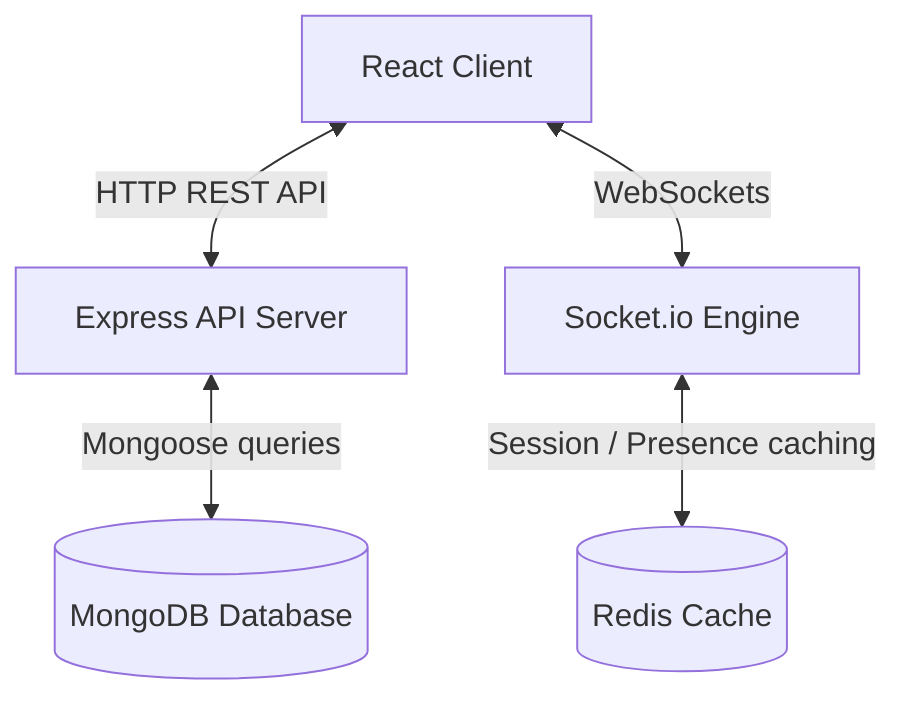

# ❄️ Polar Chat

Polar Chat is a ultra-sleek, real-time messaging application designed with a premium dark-themed aesthetic. It features instant message delivery, live typing states, interactive message statuses (delivered/read checkmarks), user presence tracking (online/offline), and an elegant Connect Code system for adding friends.

The project is built as a monorepo featuring a **React (TypeScript + Vite)** frontend and a **Node.js (Express + Socket.io + Redis + MongoDB)** backend.

---

## 🚀 Key Features

*   **Real-Time Message Delivery:** Powered by **Socket.io** for low-latency, bidirectional message exchange.
*   **Live User Presence & Session Management:** Live online/offline status indicator powered by a persistent **Redis** key-value session cache.
*   **Delivered & Read Indicators:** Visual message status states (one checkmark for *delivered*, two checks in active blue for *read*) next to your sent message bubbles.
*   **Debounced Connect Code Lookup:** Add friends via unique 6-digit connect codes. Displays a real-time card preview of the found user's profile picture and username before establishing the connection.
*   **Interactive Typing Indicators:** Real-time feedback showing when the other participant is typing.
*   **Click-to-Reveal Timestamps:** Keeps the chat interface clean and minimalist; clicking on any message bubble smoothly slides down the exact message timestamp.
*   **Infinite Chat History Scroll:** Auto-loads older message history on scroll up without disrupting the scroll position.
*   **Responsive Mobile Layout:** Complete layout flexibility utilizing a unified Mobile Chat context drawer.

---

## 🛠️ Tech Stack

### Frontend
*   **Framework:** React 19 (TypeScript) + Vite
*   **Styling:** Tailwind CSS + Vanilla CSS (Glassmorphism aesthetics)
*   **State Management:** Zustand (Stores) + React Context API
*   **Data Fetching:** React Query (TanStack Query v5) for caching and optimistic queries
*   **Router:** React Router v8
*   **Icons:** Lucide React
*   **Notifications:** Sonner

### Backend
*   **Runtime:** Node.js (ES Modules)
*   **Web Framework:** Express.js
*   **Database:** MongoDB + Mongoose (Indexes, Schema Validations, Save hooks)
*   **Cache / Session Store:** Redis (online status tracking)
*   **Real-time engine:** Socket.io (Rooms, Events)
*   **Authentication:** JWT (JSON Web Tokens) with Secure HTTP-Only Cookies

---

## 📐 Architecture & Data Flow



---

## 📁 Project Structure

```
polar-chat/
├── backend/
│   ├── controllers/      # Route controllers (Auth, Conversations, Messages)
│   ├── middlewares/      # Authentication & route guards
│   ├── models/           # MongoDB schemas (User, Conversation, Friendship, Message)
│   ├── services/         # Redis Session & online-status cache
│   ├── socket/           # WebSocket helpers & event dispatchers
│   ├── server.js         # Entry point (Server, Socket, and DB initialization)
│   └── socket.js         # Socket.io connection handlers
├── frontend/
│   ├── src/
│   │   ├── components/
│   │   │   ├── ChatWindow/# Chat viewport (Header, Input, Feed subcomponents)
│   │   │   ├── Sidebar/   # Chat sidebar (Search, Add modal, User settings)
│   │   │   └── ui/        # Shared components (Modals)
│   │   ├── contexts/      # Mobile drawers, global socket, and chats contexts
│   │   ├── services/      # Api services (apiClient, messages, conversations)
│   │   ├── stores/        # Auth state store (Zustand)
│   │   └── index.css      # Custom scrollbars and styling utility classes
```

---

## 🏁 Getting Started

### Prerequisites
Make sure you have the following installed:
*   [Node.js](https://nodejs.org/) (v20+ recommended)
*   [MongoDB](https://www.mongodb.com/) (running locally or via Atlas)
*   [Redis](https://redis.io/) (running locally)

### Setup Instructions

1.  **Clone the Repository:**
    ```bash
    git clone https://github.com/CryoMilo/polar-chat.git
    cd polar-chat
    ```

2.  **Setup Backend Server:**
    *   Navigate into `backend` and install dependencies:
        ```bash
        cd backend
        npm install
        ```
    *   Create a `.env` file in the `backend` folder:
        ```env
        PORT=4000
        CLIENT_ORIGIN=http://localhost:5173
        MONGO_URI=mongodb://localhost:27017/polar-chat
        JWT_SECRET=your_super_secret_jwt_key
        NODE_ENV=development
        REDIS_URI=redis://localhost:6379
        ```
    *   Start local MongoDB and Redis instances if they aren't already running.
    *   Launch the backend server in watch mode:
        ```bash
        npm run dev
        ```

3.  **Setup Frontend App:**
    *   Open a new terminal window, navigate into `frontend`, and install dependencies:
        ```bash
        cd ../frontend
        npm install
        ```
    *   Create a `.env` file in the `frontend` folder:
        ```env
        VITE_API_URL=http://localhost:4000/api
        ```
    *   Launch the development server:
        ```bash
        npm run dev
        ```
    *   Open your browser and navigate to `http://localhost:5173`.

---

## 🤝 Contributing

Contributions are welcome! Please open an issue or submit a pull request if you want to make enhancements, fix bugs, or suggest features.
